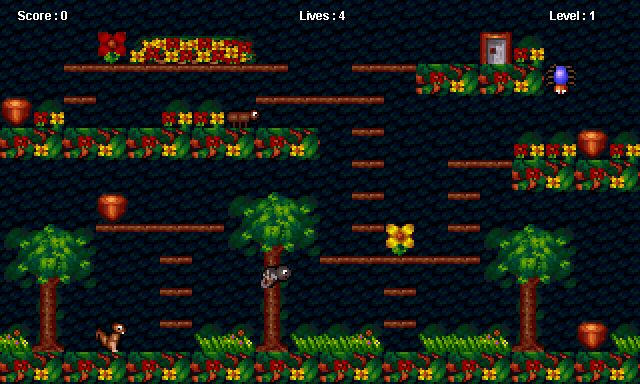

# Disclaimer
This is a fan made remake of the original game created by Burkhard Ratheiser who deserves a lot of credit for making a great platformer I enjoyed as a kid.
All fan recreations on my Git Hub  exist only for me to practice and try out different ays to make games.
The assets in the project are made by me to mimic the art style of the original game. This is because I use recreating the art in my own way to practice making
pixel art, audio for music/sound effects, and animations.

## Nobby Nuss 
Nobby Nuss is a retro platformer originally created in Java by Burkhard Ratheiser.
The game follows Nobby while he searches for nuts to prepare for hibernation for the incoming winter.
Help Nobby as he makes his way through dangerous enemies and traps that could put him into a permanent hibernation before winter even starts. 

## Tools used
Game Engine: [Unity](https://unity.com/)

Pixel Art: [Aseprite](https://www.aseprite.org/)
